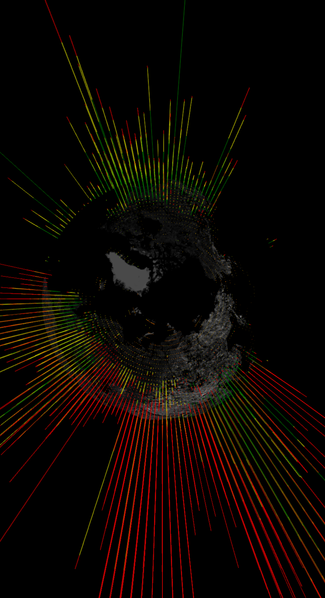

# The Father's Marble

The Father's Marble is an attempt to show the status of the Good News of Jesus Christ throughout the earth.

Here's a screenshot of the view from the North Pole, with the Americas toward the top of the picture:   

## Data Sources

Data regarding people groups and their beliefs come from [Joshua Project's public datasets and APIs](http://joshuaproject.net/resources/datasets). 
The Joshua Project exists to "Bring Definition to the Unfinished Task."  

Data regarding general global population distributions comes from NASA's 
[Gridded Population of the World, Version 3](http://sedac.ciesin.columbia.edu/data/set/gpw-v3-population-density) 
provided through CIESIN and CIAT, and are scaled such that the total world population roughly matches Joshua Project data.  

Over different versions of this project, the imagery used on the globe has come from a variety of different sources: 

 - NASA's Black Marble Imagery.  Original data courtesy NASA Earth Observatory and in the public domain.  
 - Bing Maps.  Licensed from Microsoft. 
 - Natural Earth II. Public Domain. 
 
The graphics tool used here is [Cesium](http://cesiumjs.org), which is a really awesome mapping tool. 

## Terminology

For the purposes of this application, the term __Village__ does *not* refer to something like a small town, but rather 
specifically refers to __a people group in a particular location__.  For instance, 
[the Glaro-Twabo people](http://joshuaproject.net/people_groups/11907) are in two locations, and thus have two 
"Villages".  Villages can be of drastically different sizes, both in terms of population, and in terms of geographic 
area covered. 

A __Pile__ is a collection of peoples who are designated into one statistical point.  One Pile may contain several 
Villages, and many Villages are spread between several piles. 

## How It Works

Joshua Project data provides a geographic epicenter for each Village, but doesn't provide any sort of population density 
information.  If we were to simply plot the Joshua Project data as-is, we would find, for instance, that all 180 million 
U.S. Americans (the second largest Village) live in the Mark Twain National Forest just off I-44 in the middle of 
Missouri.  However, most Americans don't live there.  Thus, we also use NASA's gridded population dataset, adjusted to 
two-degree precision, to better account for how people are distributed.  Each of these two-degree blocks is a Pile.

The Joshua Project Data and the NASA Data don't perfectly align, and there isn't really enough information to guarantee 
that all individuals will be assigned to the best pile.  So, to minimize the order of magnitude of the error, smaller 
Villages are assigned to Piles first, and remaining spaces in the piles are then filled by other villages nearby.  

The assignment of Villages to Piles is not perfect.  You will probably find some unexpected bleeding, particularly in 
places with large Villages or complex borders.  

## Data Issues & Usefulness

There are some known issues in how the data is presented, some of which won't be resolved.  Our goal is to provide a 
tool that is useful for you and your family and your church to see the regions of the world where we particularly need
to "pray earnestly to the Lord of the harvest to send out laborers into his harvest." (Matthew 9:38)  

Please don't use this for anything more than that.  It won't be able to deliver. 

In addition to potential misuse, there are other more technical issues with this visualization, as described below. 

### Missing Villages

Since this application focuses on attempting to locate people on the globe, only Villages with both population 
information and geographic information (in lat/long) are plotted.  When the data set was first compiled for this 
purpose, this meant that a total of 4,690,750 people (about 0.06% of the global population) are not accounted for. 
While we want to see the gospel reach each of these people, they have been left out of this visualization, as we have no 
good way to plot them.  Should lat/long data become available for these groups, we will update the data set. 
 
### Old Population Distribution Data

The gridded dataset we're using from NASA is dated 2000.  This is obviously old, but at the time of writing, it's the 
newest solid data available.  Since the population has expanded since then, NASA data is scaled proportionally such that
the sum equals the sum of the Joshua Project data.  Essentially, we're assuming that the population growth has occurred 
everywhere at the same rate, which isn't an accurate assumption, and makes some things weird.  For example, this is why
there will appear to be an unrealistically high number of Han Chinese listed in Alaska. 

### Ambiguous Population Distribution Data

While we have distribution information for the human race as a whole, there is no readily available data that addresses 
the issue of which Piles should contain each Village, when the Village population is larger than that of the pile. 

## Contributing, Building and Other Participation

If you find an error of any sort, please check the [Issue Tracker](https://github.com/jkrrv/fathersmarble/issues) to see 
if it's already a known issue, and create a new issue report if it's not already a known issue. 

If you want to work with the codebase, it's kinda expected that you already have some experience working with Javascript
applications.  (If you're new to Javascript, this is not the place to start.)  

There are two applications in this set: the basic application, rooted in the base directory; and the data processing application rooted in `/data`, which parses the datasets and 
converts them to useful JSON files, which are then passed to the client for display.

### Data Processing Application

The data doesn't change very often, so it's processed occasionally on the server.  This processing, and the outputs of 
it are all contained in the `/data` directory.  

To __install__ the node dependencies, from `/data`, run:

	npm install
	
To __update__ the node dependencies, from `/data`, run:

	npm update

To __run__ the data processing, from `/data`, run:

	npm start

### Front-End Application

To __install__ the node dependencies, from the root directory of the repository, run:

	npm install
	
To __update__ the node dependencies, from the root directory of the repository, run:

	npm update
	
There is no build procedure for the application, as it is (for now, anyway) completely static.  Just put the files in a
web server, and you'll have a working application. 

